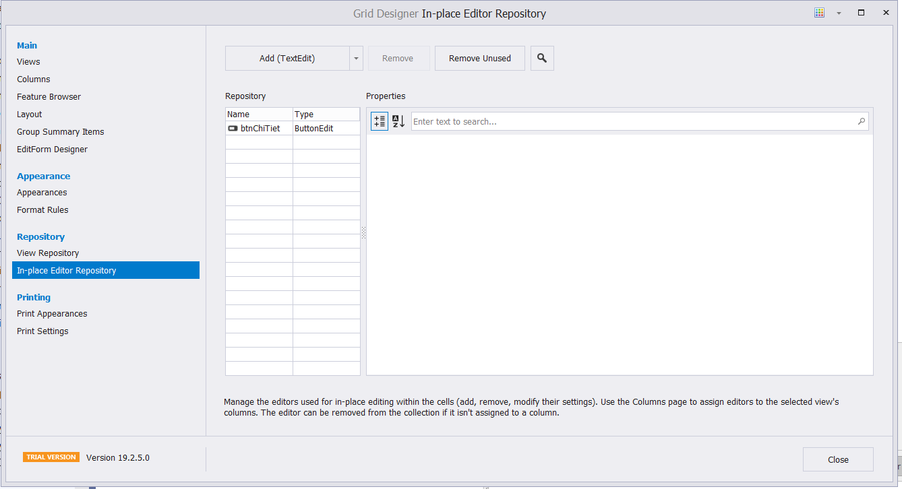
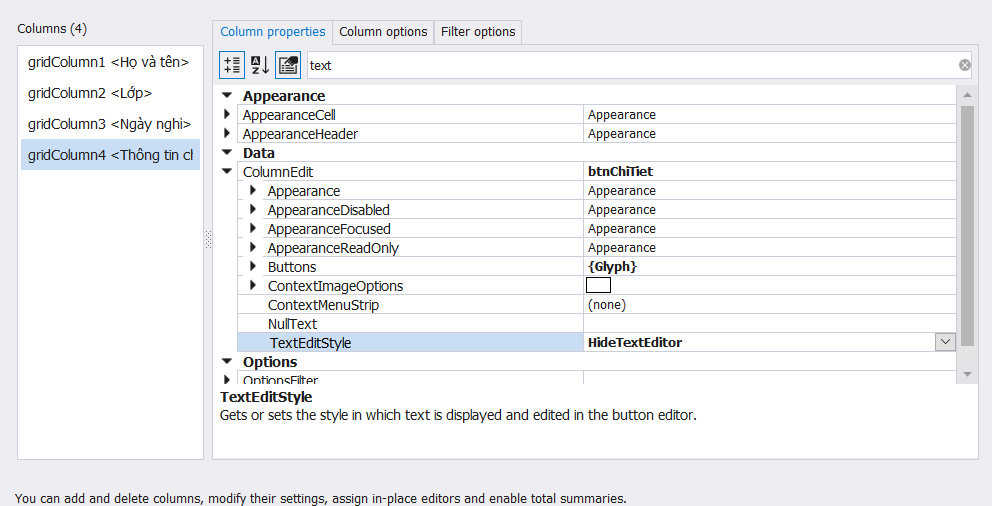
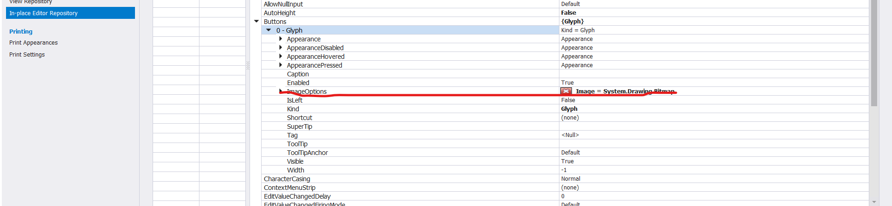
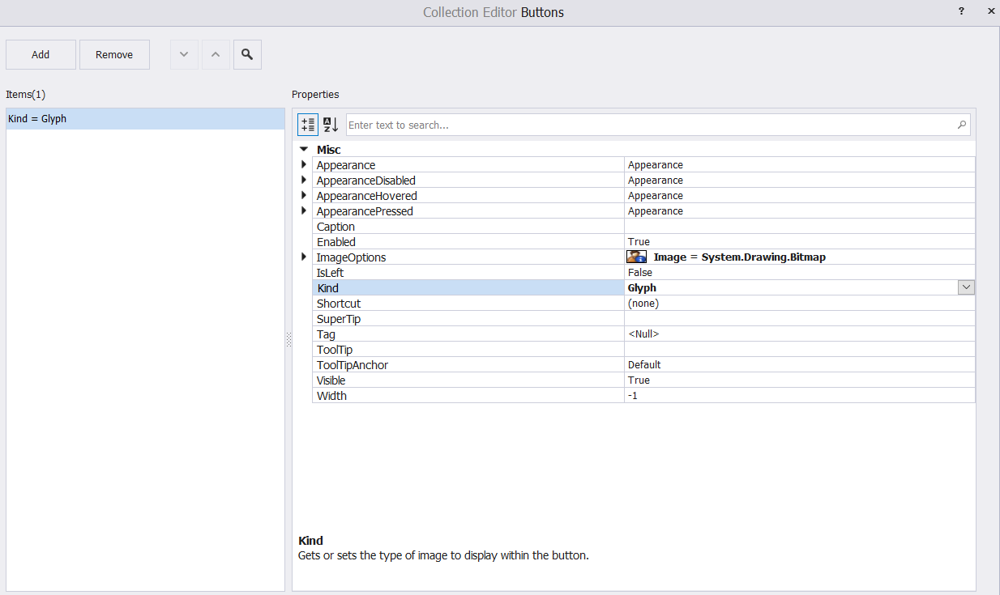
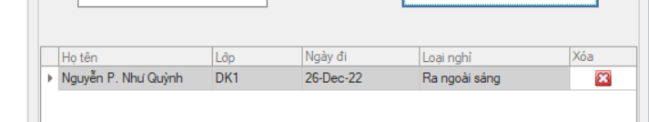
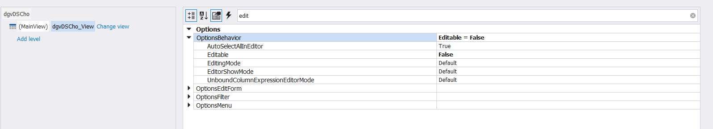

**Thêm button vào bảng**

b1 

**b2 : sửa loại button :{Glyph}** 

TextEditStyle : hidetexteditor

**b3 :** 

**b4 : sửa image options**

-----------

**right click tại grid control** 

(click chuột vào datagridview ko ấn được chuột trái chỉ dùng đc chuột phải)

**solve :**

------------

